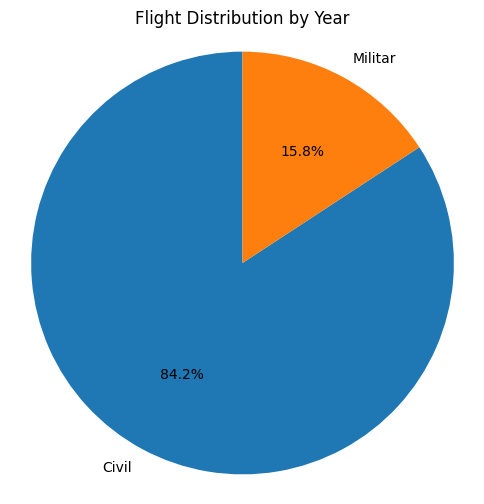
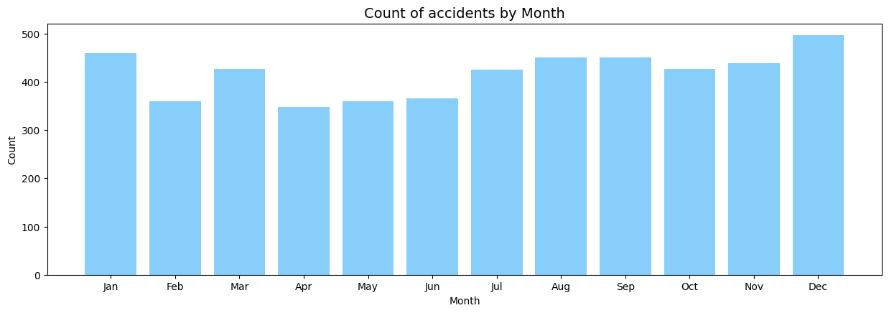
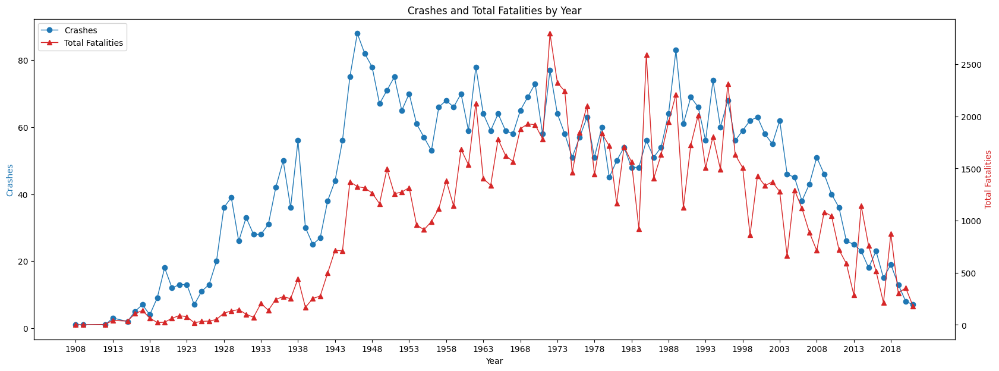
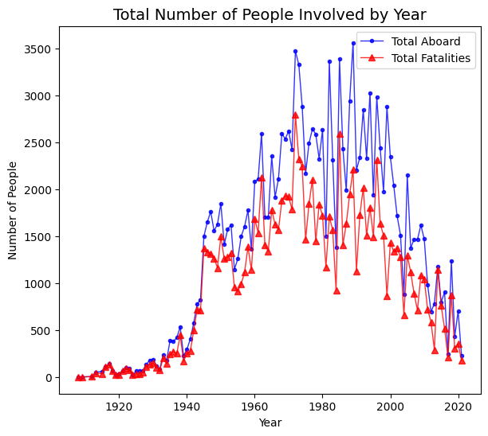
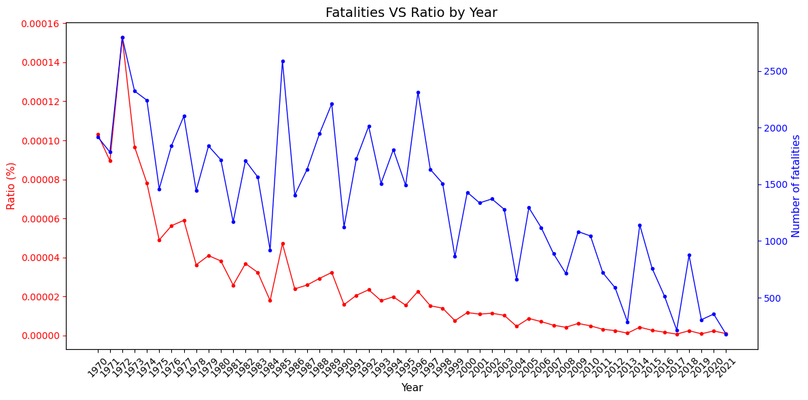
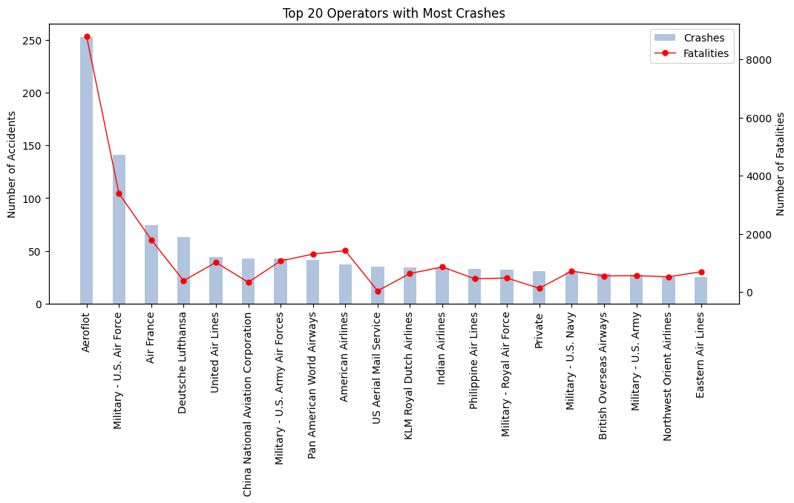
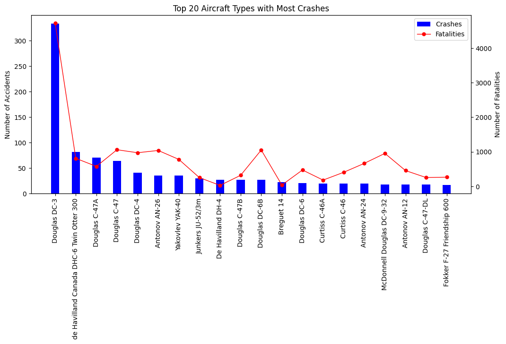

## **Introduction**

In spite of air travel being a common occurrence in the current year, it was not always the case. In fact, it can be said that this mean of transport is still fairly new and just barely past its infancy stages. This is especially true for the massification of it, something that only truly became commonplace in the past 50 years. It stands to reason then, that the safety of these giant flying hunks of metal, would be put in severe scrutiny. 
Perhaps due to how powerless we are when something goes horribly wrong doing over 1000 MpH while at 20,000 feet in the air, airplane crashes have made a lasting impact on aviation history. While technology has improved and many advances in safety protocols have been made, the focus on efficiency and ever increasing need for passenger capacity poses new challenges. This project explores the multifaceted nature of crashes, analyzing data and efforts to enhance aviation safety. Let's uncover lessons learned and advocate for a safer future in the skies.

## **Analyzing the first dataset**

The first dataset had some missing values signaled with a '?', and some random characters on the time column that made it annoying to clean.
But once that was done, it was easy to see which columns were of use and which ones weren't.
Here is a quick rundown of what was done:

## **Data Cleaning**

1. Importing the necessary libraries, including pandas, numpy, re, and stopwords and word tokenize from the NLTK library.
2. After loading the dataset into a pandas dataframe and getting aquainted with the basic structure of the data, all the columns were renamed to better reflect the contents.
3. All the irrelevant columns were dropped, ie: those that did not have relevant data or too many missing values to be of significance.
4. All the instances of the '?' symbol were changed to the appropriate values for the column, such as "Unknown" for object columns, and "0" for columns with numeric values.
5. After these transformations, all the columns were converted to the appropriate data types.
6. with that done, the time column felt redundant, so since it was now clean from all the extra data, it was merged to the date column.
7. Now this is where the work gets interesting. First i looked for word trends on the summary column. At first i was going to drop it, since it didn't look like that usefull.
8. However, on further inspection, i realized it was a treasure trove for data. So i scavenged through it for many keywords relating to weather, landing, take off, or failures.
9. Those words were turned into dictionaries, which were then used to tokenize the summary column and turn them into values for a new column that gave insights on what could have been the main cause of the accident. Unfortunately, it doesnt take into account multiple cases, ie: when poor weather affects a landing, it just gets listed as a weather cause. I might come back to revisit this to see if i can refine it further.
10. With that one done, i decided to do another word look up and filter flights to separate the military operators from the civilian flights, as that could give more insights as well.

## **Data analysis**

In order to find more insights, two different datasets were used. The first one is the one that was just transformed and analized. The second one is a more basic one, that is actually a combination between the amount of total flights in the past 50 years and the amount of people aboard these flights.
Here is a quick rundown on what was done here:

1. This time i imported pandas, numpy, re, datetime and matplotlib.
2. I actually skipped a lot of work transforming the dataset because it wasnt that large. I actually worked the two original ones with flight and passenger data on excel first, because that was going to be a lot faster than writing a bunch of code. So instead, the imported dataset already had all the important transformations done.
3. After checking the datatypes and that everything was okay with the transformed dataset, i started working on combining the columns from the 70s to 2021 of the flight accidents dataset, i was mainly interested in getting a dataframe with the total fatalities into the dataset, so that was the only column that got combined to it.
4. with the dataset combined, i decided to save it, and then started working on some graphs to get an idea of what i could do for the Power BI dashboard and to see if the data was more or less okay.

## **Insights**

Here are some of the insights that i got from these graphs and a summary of each.

First, we have the difference between civilan accidents and miliary accidents:

As we can see, most accidents are generally civilan planes. The data could probably be even lower if we ignore the 1940s, as the World War caused a huge spike in military related accidents.

Here is the total amount of accidents by month:

December and January tend to have the most crashes. This makes sense, since the northern hemisphere has the most air traffic and it's winter time, which makes weather a major concern for many aircrafts. In the southern hemisphere it's summer time, so many people leave on vacation as well. It makes sense then, that this is the season with the most air movement, due to the many festivities and events that happen at the time.

Here is a graph of the total fatalities and crashes and total fatalities per year:

At first i thought this was a bit useless to see, but in fact, this revealed some interesting insights, we have some very non-deadly peaks early on, and then accidents grow deadlier with each year. While it's true that accidents and fatalities have been on the decline, an accident in modern days have a very high chance of being fatal for most, if not all, people involved.

Which brings me to...

The total of people that have died. As we can see, the graphic is VERY similar to the one above. and the closer we get to modern day, the less deaths but the less survivors we have on each accident.

It's not all that tragic though. The problem with these graphics is that it looks like the numbers have not really improved that much from back when planes were almost exclusively used for war. However, this is where more recent data comes to the rescue.
We know that the volume of planes in the air is ludicrously high compared even to 30 years ago. Therefore behold, the magic of interpolation:

These are the ratios of fatalities vs the total deaths up to date.
as we can see, the ranges are so minuscule that you probably have higher chances of getting struck by lightning than being in a plane crash.
To put into further perspective: the most dangerous part of boarding a plane is the trip from your home to the airport.

Okay, so, sure, it is very safe, but the chances are never zero. And not all companies and not all planes are the same. it's of utmost importance to pick the company you travel with and what planes you board very carefully.

These are the companies with the most accidents:

Boarding on an Aeroflot flight is almost like asking for something bad to happen. And yes, this stays consistent no matter the year.

On the planes side, however:

The Doulgas DC-3 is a very old model, it was extremely popular until 1968, after which it started being replaced by faster and safer models. It also had to be further modified to be put up to the new safety standards as well, so most of them were decomisioned in the following years.
The DHC-6 300 is a Canadian utility aircraft that was also very popular from 1969 up to early 2000s. It's extremely practical due to the engines it uses, allowing it to hold up to 20 people, or be a cargo plane or medical evacuation plane, as well as needing very short runway spaces to take off or land. however, this also means that its one of the most prone to accidents as well, due to it being used on so many different fields. 
Finally, the Douglas C-47A is a military variation of the DC-3, so it suffered from the same problems as its civilian model.

## **Conclusions**

Based on the analysis conducted, we can draw the following conclusions for this project:

1. Airplane crashes and fatalities have significantly decreased over time, indicating improved safety measures despite the growing number of passengers.
2. The consistent reduction in incidents and fatalities demonstrates the positive trend in air travel safety, supported by both absolute numbers and relative measures.
3. The year with the highest number of fatalities appears to be 1972, which makes sense as the new generation of jets was already in operation, including the Boeing 737, which is still in use and production today. These airplanes are much larger than the first-generation jets and accommodate more passengers, hence in the case of accidents, there is likely to be a higher mortality rate, although not necessarily a higher accident rate.
4. We need to find a better standard for categorizing and summarizing the nature of plane crashes, as blaming weather conditions, the pilot, or mechanical failures for a crash doesn't paint the full picture. This way it will be easier in the future to analize the data further from an outsiders perspective into possible causes and solutions that don't just involve stricter regulations for pilots, or even more quality control on planes.
5. Overall, while air travel has become significantly safer over time, the importance of selecting reputable airlines and aircraft models remains paramount.

